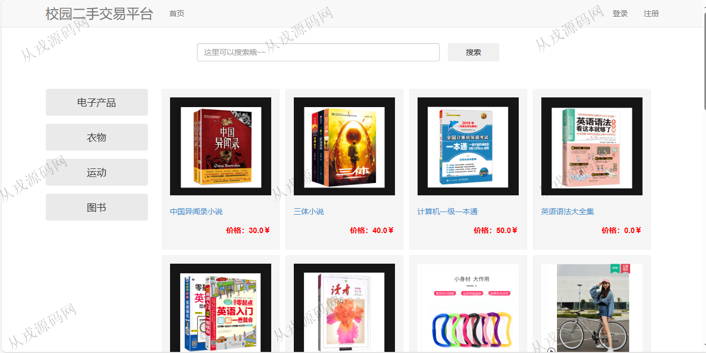
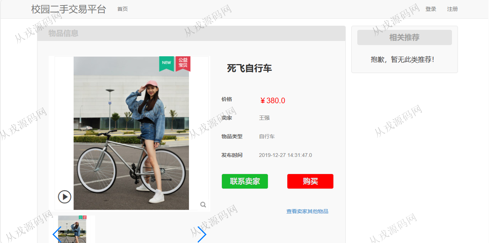
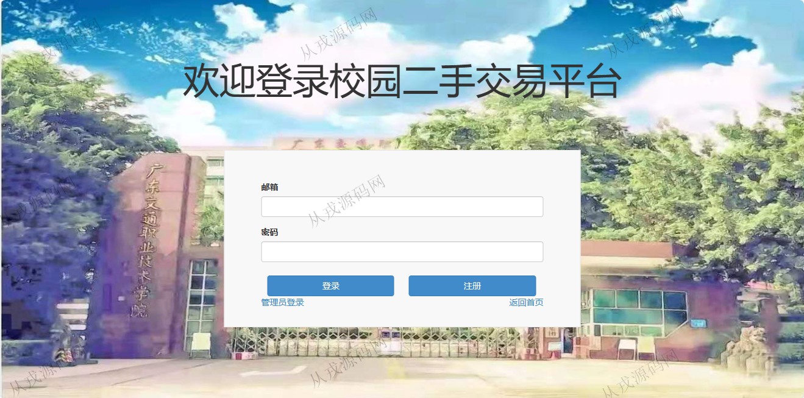
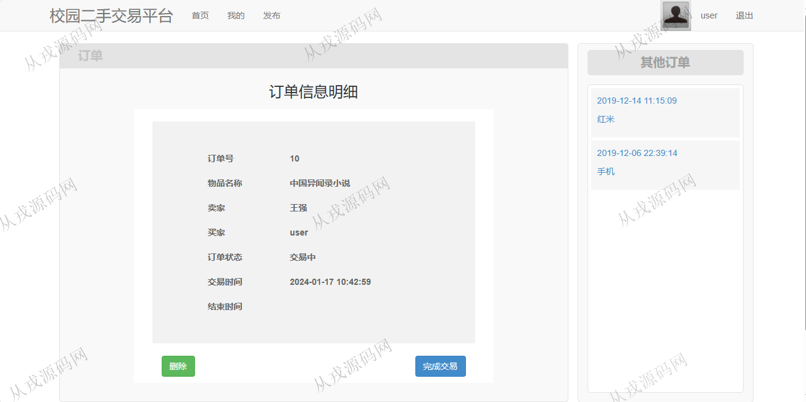
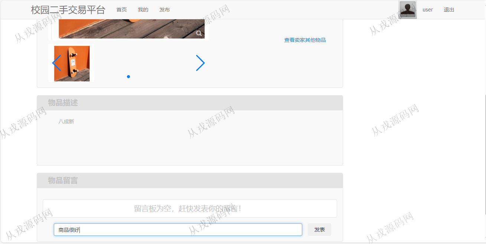
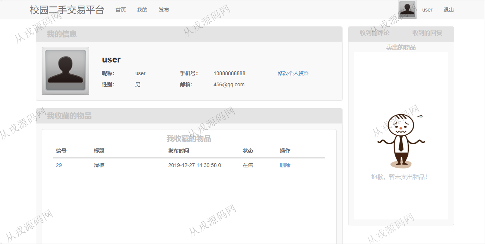
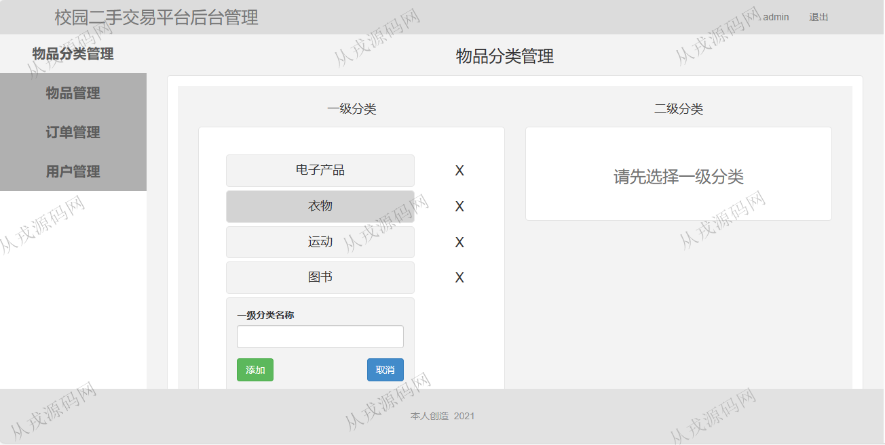
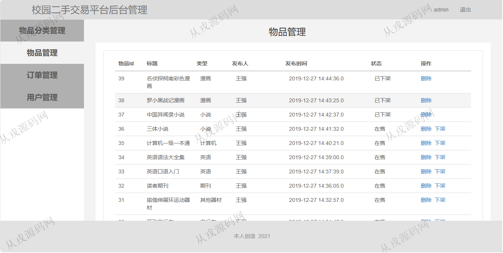
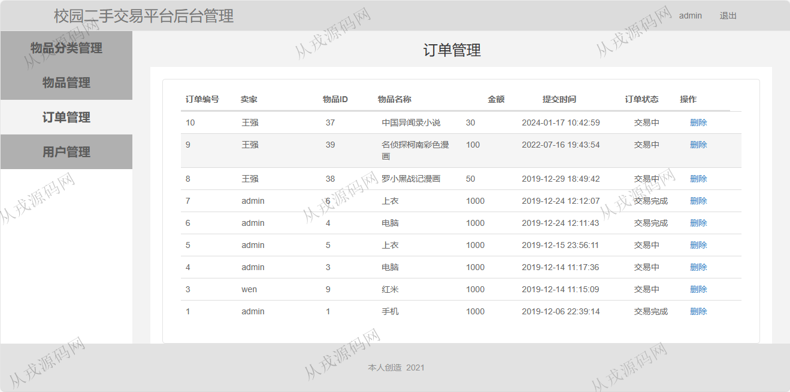

<h1 align="center">162.校园二手交易平台管理系统</h1>

 获取sql文件 QQ: 386869957 QQ群: 377586148 

 [更多源码项目: 从戎源码网](https://armycodes.com/) 

## 简介

> 本代码来源于网络,仅供学习参考使用!
>
> 提供1.远程部署/2.修改代码/3.设计文档指导/4.框架代码讲解等服务
> 
> 用户端访问地址：http://localhost:8080/wzh-secondshop/
> 
> 用户：456@qq.com 123456
> 
> 管理后台：http://localhost:8080/wzh-secondshop/admin/adminLogin
> 
> 管理员：123@qq.com 123456
> 

## 项目介绍
基于ssm的校园二手交易平台管理系统：前端 jsp、jquery，后端 maven、springmvc、spring、mybatis；角色分为管理员、用户；集成商品浏览、商品详情、在线购买、订单查询等功能于一体的系统。

## 功能介绍

### 管理员

- 物品分类管理：分类信息的增删改查，一级分类，二级分类
- 物品管理：用户发布的二手商品信息，后台管理员可以查看，删除商品，上架和下架操作
- 订单管理：用户在线购买商品后，管理员可以查询订单信息，订单删除，订单状态
- 用户管理：用户在前台自行注册的用户账号信息，管理员可以删除、禁用、激活

### 用户

- 基本功能：登录，注册，退出
- 网站首页：全局搜索，分类导航，商品列表展示
- 商品：商品详情，商品收藏，联系卖家，物品留言，在线购买
- 发布商品：用户可以将自己闲置的二手商品发布到平台上进行售卖
- 我的：用户信息查看与修改，修改头像，密码修改，我收藏的物品，我发布的物品，我的订单

## 环境

- <b>IntelliJ IDEA 2021.3</b>

- <b>Mysql 5.7.26</b>

- <b>Tomcat 7.0.73</b>

- <b>JDK 1.8</b>

## 运行截图

